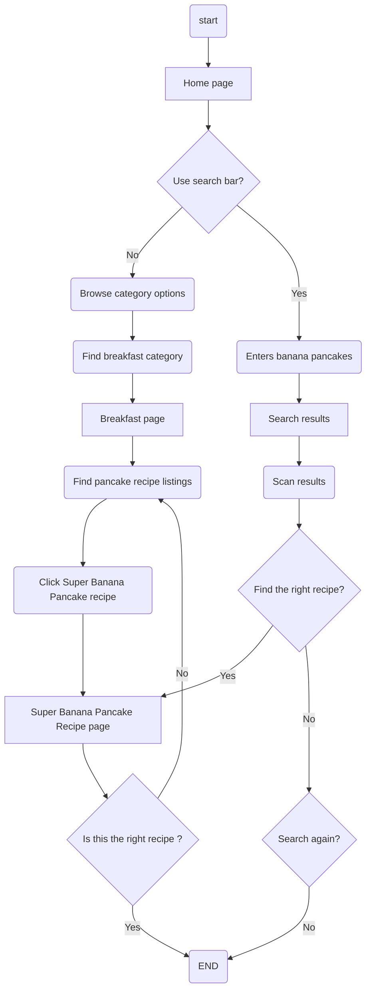

# alalakisdadd
# Chart

```mermaid
flowchart TB
start(start) --> homePage[Home page]
homePage --> searchBar{Use search bar?}
searchBar -- No --> browseCategory(Browse category options)
browseCategory --> findBreakfast(Find breakfast category)
findBreakfast --> breakfastPage[Breakfast page]
breakfastPage --> findPancake(Find pancake recipe listings)
findPancake --> clickSuper(Click Super Banana Pancake recipe)
clickSuper --> superBana
searchBar -- Yes --> enterBanana(Enters banana pancakes)
enterBanana --> searchResults[Search results]
searchResults --> scanRes(Scan results)
scanRes --> findRecipe{Find the right recipe?}
findRecipe -- Yes --> superBana[Super Banana Pancake Recipe page]
findRecipe -- No --> searchAgain{Search again?}
searchAgain -- No --> end1(END)
superBana --> isRgiht{Is this the right recipe ?}
isRgiht -- No --> findPancake
isRgiht -- Yes --> end1
```

