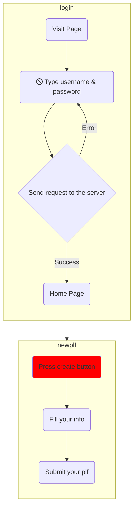

```mermaid
flowchart TB
classDef redColor fill:red

subgraph login
  direction TB
  visit(Visit Page) --> type(fa:fa-ban Type username & password)
  type --> request{Send request to the server}
  request -- Success --> home(Home Page)
  request -- Error --> type
  click visit "https://www.github.com" _blank
end  

subgraph newplf
  direction TB
  create(Press create button):::redColor --> fill(Fill your info)
  fill --> submit(Submit your plf)
end 

login --> newplf


```
