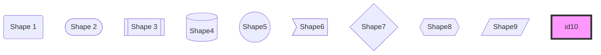

```mermaid
flowchart TB
 id1(Shape 1)
 id2([Shape 2])
 id3[[Shape 3]]
 id4[(Shape4)]
 id5((Shape5))
 id6>Shape6]
 id7{Shape7}
 id8{{Shape8}}
 id9[/Shape9/]
 id10
 style id10 fill:#f9f,stroke:#333,stroke-width:4px
```
